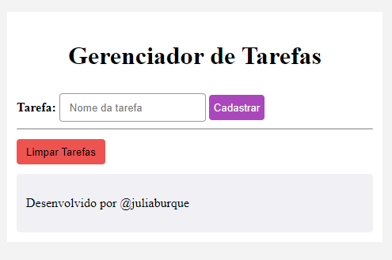

# ToDoList

# Gerenciador de Tarefas
Um simples gerenciador de tarefas em PHP com uso de sessões para armazenar e exibir tarefas cadastradas pelo usuário.

## Funcionalidades
- Adicionar tarefas
- Limpar lista de tarefas

## Pré-requisitos
Certifique-se de ter um servidor web com suporte a PHP para executar este aplicativo.

## Como usar
1. Clone ou baixe os arquivos para o seu servidor web.
2. Inicie o servidor web.
3. Acesse o aplicativo através do navegador.

## Guia de Uso
1. No formulário, digite o nome da tarefa que deseja adicionar e clique em "Cadastrar".
2. A lista de tarefas será exibida abaixo do formulário.
3. Para limpar todas as tarefas, clique no botão "Limpar Tarefas".

## Estrutura do Projeto
- `index.php`: Página principal que exibe o formulário de cadastro e a lista de tarefas.
- `style.css`: Arquivo de estilo para personalizar a aparência do aplicativo.
- `README.md`: Este arquivo, contendo informações sobre o projeto.

## Fontes
## Autor
Desenvolvido por [@nomedodev] 

